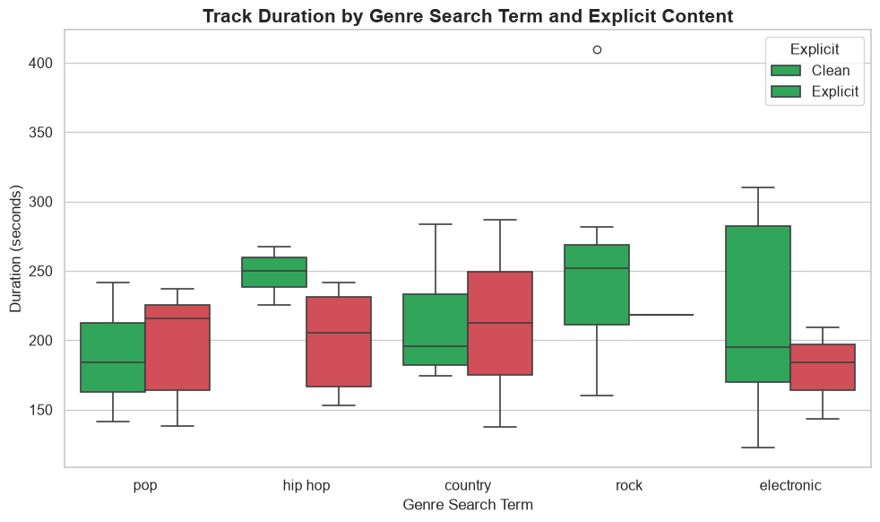
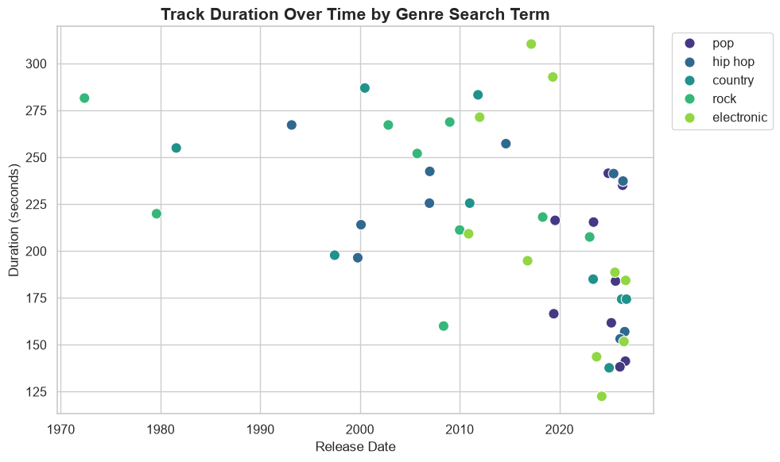

# Projects

This section documents my data science projects, research questions, and data stories I create throughout the semester.

---

## Project 1: Does Explicit Content Affect Song Popularity?

**Status:** In progress

**Research Question:** Does having explicit content help or hurt a song's popularity on Spotify, and does that relationship differ across genres?

**Data Source:** Data pulled from the [Spotify Web API](https://developer.spotify.com/documentation/web-api), using the Client Credentials authentication flow.

**Key Variables:**
- Popularity Score — Spotify's internal metric reflecting a track's popularity
- Explicit Content Flag — whether a track is marked explicit or clean (main independent variable)
- Genre
- Duration — converted from milliseconds to seconds
- Track Age — time since release, calculated from release date

**Progress so far:** I successfully authenticated with the Spotify API and built a working data pull pipeline. I ran into limitations with Spotify's genre-based search filtering while collecting a clean, genre-labeled sample, which I'm resolving to finalize the dataset, cleaning steps, and visualizations.

### Visualizations

